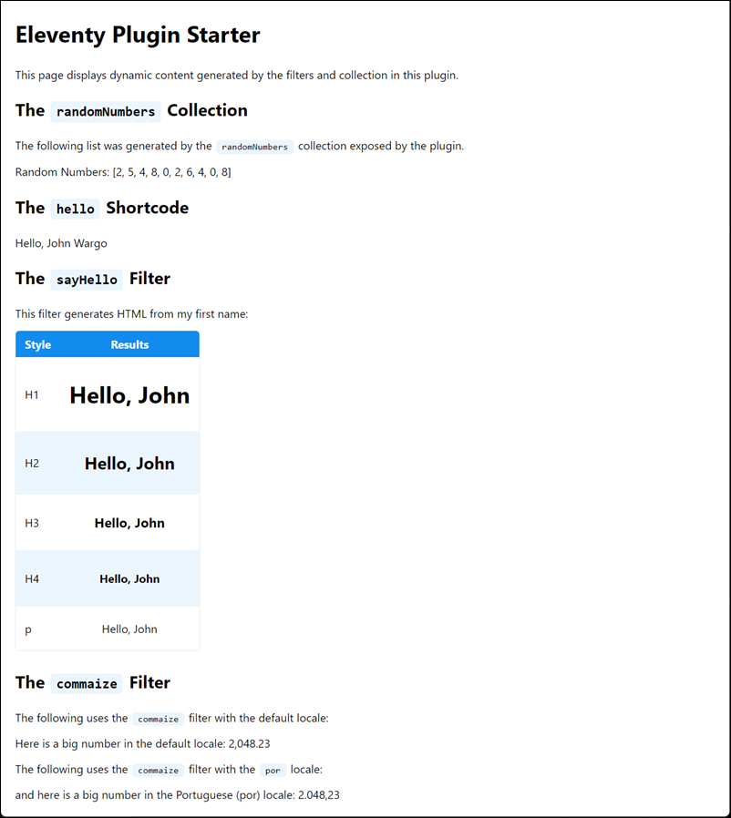

# Eleventy Plugin Starter (JavaScript)

When I first started trying to figure out how to write my own Eleventy plugin, many of the articles showed how to do it, but never showed a complete project. For me, to truly understand what I had to deliver in my plugin, I had to know what the project structure looked like. Once I had that, the rest of the work was just writing the JavaScript code for the plugin. 

This repository contains a complete Eleventy plugin as well as a complete Eleventy site that exercises the plugin. With this approach, you done have to maintain an external Eleventy project to test the plugin as you work, you can code and test the plugin in the same place.

To make this project more useful to you, it includes several Eleventy capabilities through the plugin:

* An Eleventy `randomNumbers` collection that returns a list of 10 random numbers.
* An Eleventy `hello` shortcode that takes a name variable and returns the standard "hello, Name" you see in many examples
* Two Eleventy filters, one that generates dynamic HTML based in input values and another that reformats content using default and configurable options.

The repository also includes an Eleventy site that exercises the plugin capabilities on the site's home page (shown below).

Take a look at the repository's `src/index.md` file to see the source for the home page.

To launch the site, open a terminal window or command prompt to the project folder and execute the following commands:

```shell
npm install
npm start
```

This installs the required modules then builds the site:

```text
> eleventy-plugin-starter-template@0.0.1 start
> eleventy --serve

[11ty] Writing _site/index.html from ./src/index.md (liquid)
[11ty] Copied 3 files / Wrote 1 file in 0.10 seconds (v2.0.1)
[11ty] Watching…
[11ty] Server at http://localhost:8080/
```

Open the link listed in the build output to launch the generated site.



## Anatomy of an Eleventy Plugin

An Eleventy plugin is essentially Javascript code exposed through a Node module. In this project, all an Eleventy project needs to consume the plugin is the `eleventy-plugin-starter-template.js` file in the root of the repository. If you wanted to, you could copy that file to your Eleventy project and load it using the following code in the site's `.eleventy.js` or `eleventy.config.js` file:

```js
const starterTemplate = require('./eleventy-plugin-starter-template.js');

module.exports = eleventyConfig => {

  eleventyConfig.addPlugin(starterTemplate);

};
```

With that in place, you can use the capabilities exposed by the plugin in the site (as illustrated in this repository's the repository's `src/index.md` file).

Node and `npm` make it easier by packaging the JavaScript file, the `package.json` file, and other stuff into a package you publish to https://npmjs.org so others can easily install it in an eleventy site using:

```shell
npm install eleventy-plugin-starter-template
```

you still have to do this stuff (notice the `./` is missing from the first line):

```js
const starterTemplate = require('eleventy-plugin-starter-template.js');

module.exports = eleventyConfig => {

  eleventyConfig.addPlugin(starterTemplate);

};
```

But at least you don't have to manually copy the JavaScript file to each project.

The project's `.npmignore` handles hiding the Eleventy site project files from npm so that only the files needed to use the plugin make it into the npm package and therefore other Eleventy projects that use the plugin. Here's the contents of the project's `.npmignore` file:

```text
# Folders
_site/
node_modules/
src/

# files
.gitignore
eleventy.config.js
home.png
```
